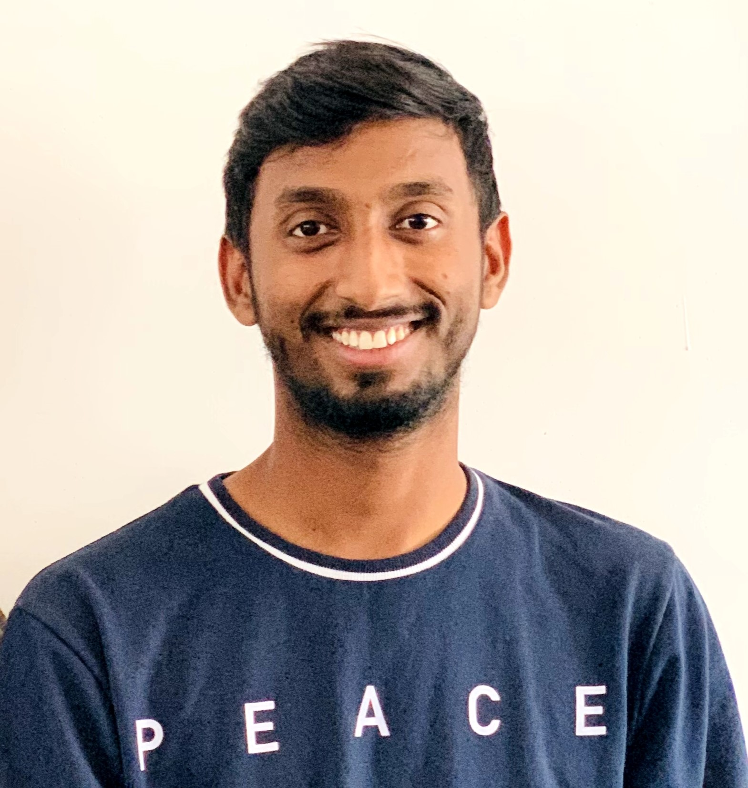

# Shiva Ram Reddy Marthala
Hi myself Shiva Ram Reddy Marthala, I'm from India. I did my bachelor's in computer science and done the certification in my area of interest. Currently I'm pursuing my masters in Computer science at Northwest Missouri State University. And most of the time to spend myself in playing __Cricket,volleyball,chess,badminton,etc__. Having dream to visit one of the top listed tourist place **Ladakh**, the destiny of life.  

****

# Sports
Sport Specialization At a young age, children tend to start participating in sports as a way to get active and learn both athletic as well as life skills. Their parents might start them off with one sport and then before you know it the child is juggling a handful of sports to see, which ones they like. As these young athletes get older, they tend to get stuck at a crossroad.

|Sport Name|Reason|Hours|
|----------|------|-----|
|Football|Reducing body fat, Building strength, stamina and speed|2|
|Badminton|Playing this sport allows you to socialise with other people|2|
|Cricket|Flexibility,Increased Stamina and Endurance, team Building|3|
|Volleyball|Improves Hand Eye Co Ordination|2|

****
****

# Quotes

>"The greatest enemy of knowledge is not ignorance, it is the illusion of knowledge." - Stephen Hawking

>“Success can come to you by courageous devotion to the task lying in front of you.” - CV Raman

>“Dream is not the thing you see in sleep but is that thing that doesn't let you sleep.”
― A.P.J. Abdul Kalam

